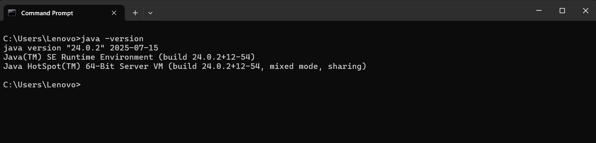
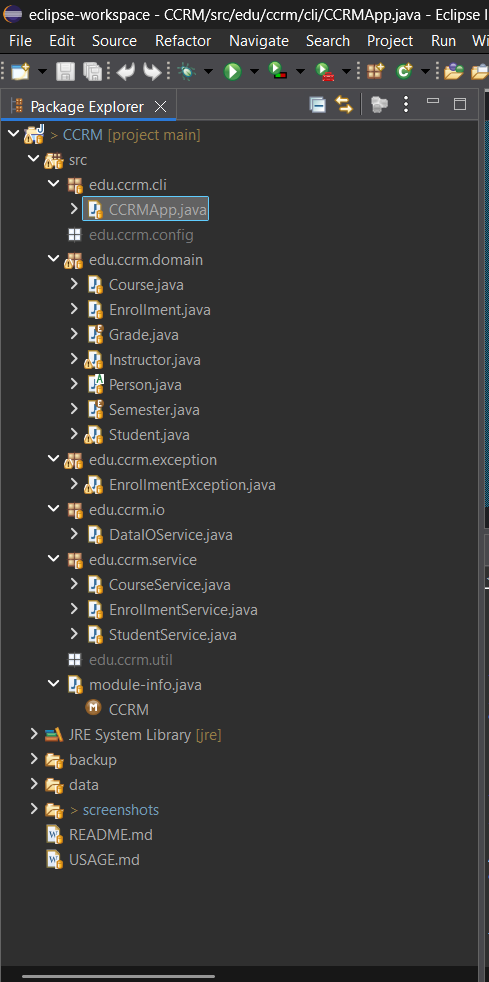
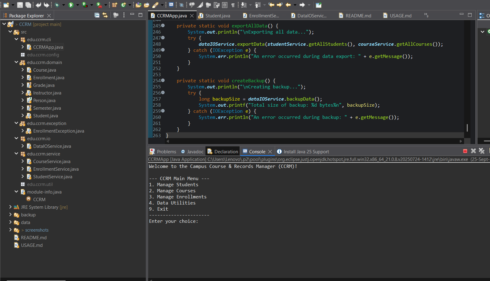
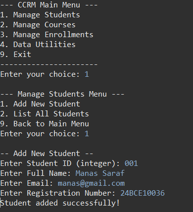
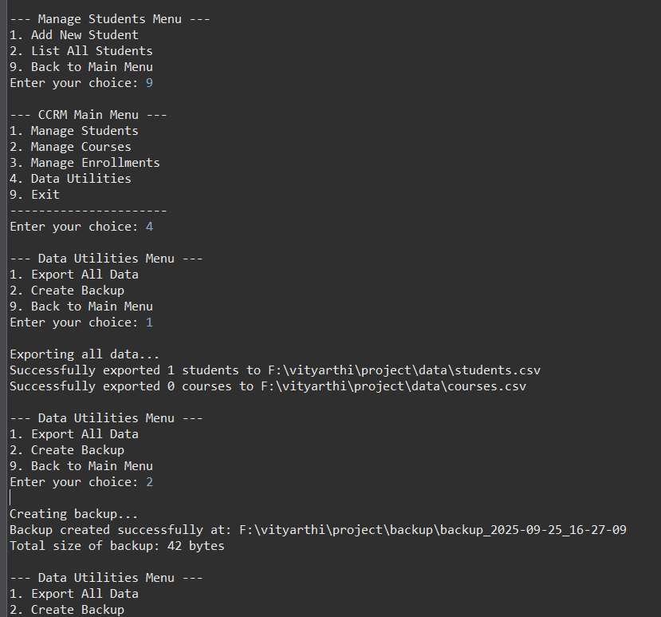
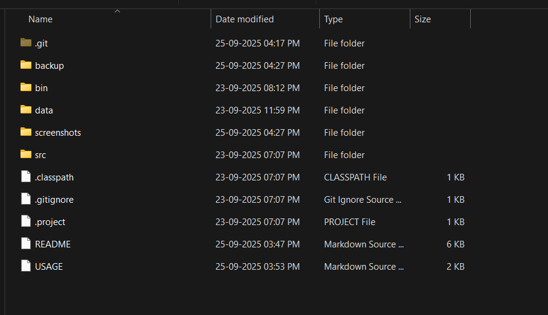
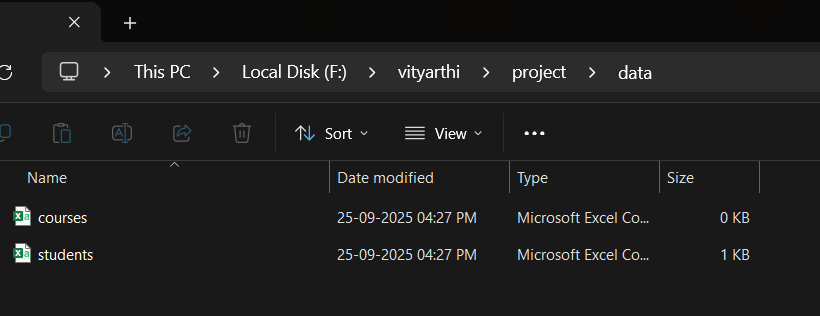
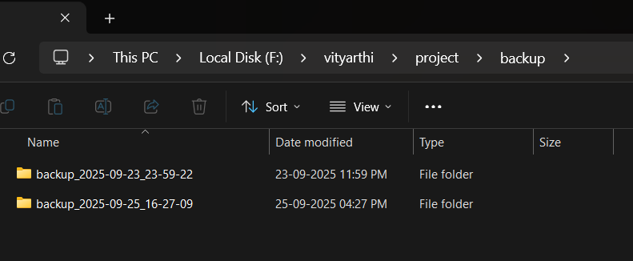

# Campus Course & Records Manager (CCRM)

This is a Java console program whose purpose is to handle grades, enrollments, student records, and courses offered by the campus.

### Project Overview
* **Student Management:** Create and list student records.
* **Course Management:** Add, find, and list courses.
* **Enrollment & Grading:** Handle student enrollments.
* **File Operations:** Export data to CSV files and create backups.
* **Console-based UI:** The application is run via a menu-driven command-line interface.

### Technical Implementation

This project demonstrates the following key Java concepts:
* **Object-Orienting Programming:**
    * **Encapsulation:** Private fields are used with public getters and setters.
    * **Inheritance:** The `Student` and `Instructor` classes inherit from the `Person` abstract class.
    * **Abstraction:** The `Person` abstract class defines a common interface for its subclasses.
    * **Polymorphism:** The `getProfile()` method is overridden in `Student` and `Instructor`.
* **Design Patterns:** The **Builder Pattern** is used to create `Course` objects.
* **Exceptions:** Custom exceptions, such as `EnrollmentException`, are used for specific business logic.
* **Java APIs:**
    * **Streams API:** Used in `CourseService` and `DataIOService` for filtering and processing collections.
    * **NIO.2:** Used for file operations like exporting data and creating backups.
    * **Date/Time API:** Used in the `Enrollment` class to get the current date.
* **Recursion:** The `calculateDirectorySize` method in `DataIOService` uses recursion.
* **Enums:** The `Grade` enum uses a constructor to hold `gradePoint` values, while `StudentStatus` and `Semester` are simple enumerations.

***

### Installation & Setup
#### **Prerequisites**
* Java Development Kit (JDK) 11 or higher
* Operating System: Windows
* Memory: Minimum 512MB RAM
* Disk Space: 100MB for application and data

#### **Windows Installation Steps**
1.  **Download JDK:** Visit the Oracle JDK or OpenJDK website.
2.  **Install JDK:** Run the downloaded installer and follow the wizard.
3.  **Set Environment Variables:**
    * Open System Properties → Advanced → Environment Variables.
    * Add a `JAVA_HOME` variable pointing to your JDK installation directory (e.g., `C:\Program Files\Java\jdk-17`).
    * Add `%JAVA_HOME%\bin` to your `PATH` variable.
4.  **Verify Installation:**
    ```cmd
    java -version
    javac -version
    ```

#### **Eclipse IDE Setup**
1.  **Download Eclipse:** Visit the Eclipse Downloads page and get the "Eclipse IDE for Java Developers" package.
2.  **Create New Project:**
    * Launch Eclipse and select **File** → **New** → **Java Project**.
    * Uncheck "Use default location" and browse to your project folder.
3.  **Configure Project:**
    * Right-click the project → **Properties** → **Java Build Path**.
    * Ensure the `src` folder is listed as a source folder.
4.  **Run Configuration:**
    * Right-click `CCRMApp.java` → **Run As** → **Java Application**.

***

### How to Run
#### **Eclipse IDE**
1.  Import the project into Eclipse.
2.  Right-click on `CCRMApp.java` in the `edu.ccrm.cli` package.
3.  Select **"Run As"** → **"Java Application"**.

***

### Project Structure
```

CCRM/
├── src/
│   └── edu/
│       └── ccrm/
│           ├── cli/
│           │   └── CCRMApp.java                \# Main application entry point
│           ├── domain/
│           │   ├── Person.java                 \# Abstract base class
│           │   ├── Student.java                \# Student entity
│           │   ├── Instructor.java             \# Instructor entity
│           │   ├── Course.java                 \# Course entity
│           │   ├── Enrollment.java             \# Enrollment entity
│           │   ├── Grade.java                  \# Grade enum
│           │   └── Semester.java               \# Semester enum
│           ├── service/
│           │   ├── StudentService.java         \# Student business logic
│           │   ├── CourseService.java          \# Course business logic
│           │   └── EnrollmentService.java      \# Enrollment business logic
│           ├── io/
│           │   └── DataIOService.java          \# File I/O operations (Export, Backup)
│           └── exception/
│               └── EnrollmentException.java    \# Custom exception
├── data/                                         \# Data directory (created on export)
├── backup/                                       \# Backup directory (created on backup)
└── README.md


```
***

### Java Evolution Timeline
* **1995:** Java 1.0 - The initial release with the "Write Once, Run Anywhere" concept.
* **2004:** Java 5.0 - Introduced major features like Generics, Autoboxing, and Enums.
* **2014:** Java 8 - A landmark release that brought Lambda expressions, the Streams API, and the new Date/Time API.
* **2018:** Java 11 - A Long-Term Support (LTS) version with a new HTTP client.
* **2021:** Java 17 - The latest LTS version, including sealed classes and pattern matching enhancements.
* **2023:** Java 21 - The most recent LTS version, introducing virtual threads.

***

### Java Platform Comparison

| Platform | Full Name | Target Environment | Use Cases |
| :--- | :--- | :--- | :--- |
| **Java SE** | Standard Edition | Desktop & Server | This project, command-line tools, and desktop applications. |
| **Java ME** | Micro Edition | Mobile & Embedded | Old feature phones and sensors. |
| **Java EE** | Enterprise Edition | Enterprise Applications | Large-scale web applications, banking systems, and e-commerce platforms. |

***

### Java Architecture: JDK, JRE, and JVM
* **JVM (Java Virtual Machine):** An abstract machine that provides the runtime environment to execute Java bytecode. It is the core component that makes Java "platform-independent" by interpreting the compiled code.
* **JRE (Java Runtime Environment):** A software package that contains everything needed to **run** a Java program. It includes the JVM and core Java libraries. You need the JRE to execute an application.
* **JDK (Java Development Kit):** The full development kit. It contains everything in the JRE, plus the tools needed to **develop** Java applications, such as the `javac` compiler and a debugger.

***

### Screenshots 

* #### Java version

* #### Eclipse

* #### Landing page

* #### Operation

* #### Export and Backup

* #### Backup and Data folders

* #### Data folder

* #### Backup folder


